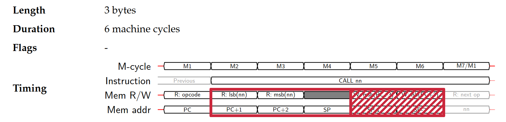

# FIFO overrun

Sometimes, through lack of oversight — or maybe through overthinking — you come up with the wrong number at just the wrong place to create an infuriating bug.

Imagine having written an emulator up to, say, scrolling pixels, but instead of seeing a black bar or a logo scroll down, you get this:


... okay, that's original.

## Stage one: denial

As you can see, the whole PPU logic works: it's perfectly capable of rendering that ® tile, and to make it scroll. Where the hell is the rest of the logo?

It looks just like the logo's tiles did not exist at all in video memory. Fortunately, it's not that hard to figure out where in the boot ROM code they are copied there.

Well, it's not trivial either. The logo tiles are read from the cartridge, but not directly copied to the video RAM[^1].

[^1]: I'm not going to go into detail here because it's going to be the next article.

Actually, there's a clear bit of code that writes logo tiles in the background map, and as it turns out, this is the only subroutine[^2] in the ROM code, that is the only part of the code using `CALL` to jump to a specific memory zone and `RET` to go back to where the code was being executed before.

[^2]: I'm using "subroutine" in a broad sense here, as it's got two entry points but it's accessed through `CALL` nonetheless.

```nasm
CALL $0095	; $0028
CALL $0096	; $002b
```

This is part of a loop that reads tile data from the cartridge and runs it through the routine starting at address 0x0095 in the ROM code. The [annotated source code](https://gbdev.gg8.se/wiki/articles/Gameboy_Bootstrap_ROM#Contents_of_the_ROM) makes it explicit enough.

```nasm
; ==== Graphic routine ====

LD C,A		; $0095  "Double up" all the bits of the graphics data
LD B,$04	; $0096     and store in Video RAM
```

So wait, what kind of bug could cause this code to be skipped entirely? Everything else seems to work, could it just be that my implementation of `CALL` was broken?

## Stage two: anger

I traced it, and it turned out to be worse than that.

I once mentioned you could have funny bug if you [didn't size your micro-operations FIFO correctly](). I even wrote that **5** was the maximum number of micro-operations we'd ever have.

What do you think happens when, through lack of oversight — or maybe through overthinking — the FIFO's size is set to only **3**?

Well, it just so happens to work perfectly fine for all other CPU instructions. Except `CALL`. But it doesn't break in a clear, obvious way that would make the emulator crash, no.

Here's how `CALL` works internally, each bullet point representing an operation in the FIFO:

* Read the first byte of the destination address.
* Read the second byte of the destination address.
* [Do nothing for a cycle](https://blog.tigris.fr/2021/07/28/writing-an-emulator-timing-is-key/#Complex_instructions).
* Push the first byte of the current `PC` address to the stack.
* Push the second byte of the current `PC` address to the stack and set `PC` to the destination address (i.e. jump to the destination address).



And there we are: the FIFO only contained the first three steps, and as `PC` was never updated, it was just like `CALL` had no effect. Hence, no tiles copied to the video RAM *except* that ®, which is added later in the process and is encoded as a proper tile in the boot ROM itself.

## Stage three: bugfix

There are two lessons here:

* *Always* check for error return status in your code. My FIFO implementation did return an error code if you tried adding items to it when it was full. That's the first thing I should have checked.
* Make it just work first. Try and be clever later. Premature optimization is real.

It wasn't hard to fix once I understood it, and in the end it was kind of a funny bug to encounter.

And what's that routine for anyway? That's what I'm hoping to show, in a lot more detail, in the next article.

Thanks for reading!